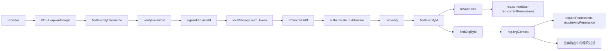
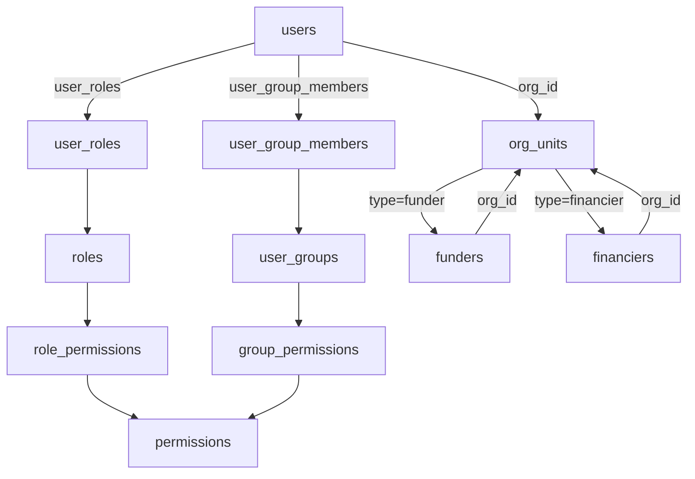

# 系统权限与组织架构详解

> 更新时间：2026-04-14
>
> 说明：本文基于当前仓库代码实现梳理，描述“实际已落地行为”，不是理想化蓝图，也不是旧版设计稿的简单转写。

## 1. 结论先行

- 系统采用 `JWT + RBAC + 组织型多租户` 组合模型。
- 权限计算以“角色权限 ∪ 用户组权限”为准，且鉴权中间件支持 `*` 超级权限。
- 组织树由 `org_units` 承载，组织类型分为 `platform` / `funder` / `financier`，并通过 `related_entity_id` 绑定业务主体。
- 多租户隔离已经落地到运单、定向支付、收益等模块，但还没有在所有业务 API 中统一收口。
- 前端菜单、标签页和部分页面逻辑依赖权限码；但当前用户对象没有把服务端 `orgContext` 返回给前端，导致部分“按组织身份定制 UI”的逻辑只能部分生效。
- 定向支付模块存在重复路由注册，同一路径在 `routes.ts` 和 `directed-payment-routes.ts` 中都有实现，实际生效逻辑受挂载顺序影响。

## 2. 文档范围

- Backend: `backend/src/index.ts`, `backend/src/auth.ts`, `backend/src/store.ts`, `backend/src/routes.ts`, `backend/src/directed-payment-routes.ts`, `backend/src/revenue-routes.ts`, `backend/src/waybills-query.ts`, `backend/src/funders-store.ts`, `backend/src/financiers-store.ts`, 以及相关 migration。
- Frontend: `frontend/src/auth.tsx`, `frontend/src/App.tsx`, `frontend/src/layouts/AppLayout.tsx`, `frontend/src/api.ts`, `frontend/src/types.ts`，以及系统管理相关页面。
- 本文重点覆盖：认证机制、权限体系、组织模型、多租户数据隔离、系统管理功能边界，以及当前实现中的偏差和风险。

## 3. 整体架构概览

### 3.1 后端路由结构

- `backend/src/index.ts` 将 `routes.ts` 作为主 API Router 挂到 `/api`。
- 同时还把 `revenue-routes.ts`、`contract-loan-routes.ts`、`dashboard-routes.ts` 和 AI 路由独立挂到 `/api`。
- `routes.ts` 内部又 `router.use(directedPaymentRoutes)`，因此项目是“超大主路由文件 + 若干模块化子路由文件”的混合架构。

这意味着当前权限和租户规则不是单点集中治理，而是分散在：

- 通用鉴权中间件
- 主路由文件
- 模块子路由文件
- 具体业务查询函数

### 3.2 请求链路



## 4. 核心数据模型

### 4.1 模型分工

- 用户 `User`：登录主体、操作主体。
- 角色 `Role`：固定权限模板，偏纵向职责。
- 用户组 `UserGroup`：横向编组和附加授权，偏批量授权。
- 权限 `Permission`：原子授权点，按树组织。
- 组织 `OrgUnit`：层级容器，同时承担租户身份标签。
- 业务主体 `Funder` / `Financier`：资金方、融资方档案；与组织双向关联。

一个很重要的设计点是：角色、用户组、组织是三条并列维度，不互相替代。

- 角色解决“岗位职责”
- 用户组解决“横向编组授权”
- 组织解决“租户边界与层级归属”

### 4.2 关系图



### 4.3 核心表

| 表 | 用途 | 关键字段 |
|---|---|---|
| `permissions` | 权限定义与树结构 | `code`, `name`, `parent_id`, `deleted_at` |
| `roles` | 角色基本信息 | `name`, `description` |
| `role_permissions` | 角色到权限的多对多 | `role_id`, `permission_code` |
| `user_groups` | 用户组 | `name`, `description`, `deleted_at` |
| `group_permissions` | 用户组到权限的多对多 | `group_id`, `permission_code` |
| `org_units` | 组织树与租户标签 | `name`, `parent_id`, `type`, `related_entity_id`, `is_active`, `deleted_at` |
| `users` | 用户主体 | `username`, `display_name`, `password_hash`, `org_id`, `is_active`, `deleted_at` |
| `user_roles` | 用户到角色的多对多 | `user_id`, `role_id` |
| `user_group_members` | 用户到用户组的多对多 | `user_id`, `group_id` |
| `funders` | 资金方档案 | `org_id` |
| `financiers` | 融资方档案 | `org_id` |

### 4.4 软删除

- `permissions`, `user_groups`, `org_units`, `users`, `i18n_entries` 等表都带 `deleted_at`。
- 多数读取逻辑都会显式带 `deleted_at IS NULL`。
- 因此系统管理对象以软删除为主，而不是直接物理删除。

## 5. 认证设计

### 5.1 登录

- 路径：`POST /api/auth/login`
- 实现位置：`backend/src/routes.ts`
- 流程：
  1. `findUserByUsername()`
  2. 校验 `user.isActive`
  3. `verifyPassword()`
  4. `getSafeUserById()`
  5. `signToken(user.id)`
  6. 返回 `{ token, user }`

### 5.2 JWT 设计

- JWT payload 只包含 `userId`
- 默认过期时间是 `7d`
- secret 来自 `JWT_SECRET`

这说明 token 自身非常轻，用户权限和组织信息不写进 token，而是在每次请求中间件阶段回表恢复。

### 5.3 当前用户恢复

- 路径：`GET /api/auth/me`
- 前端 `AuthProvider` 会从 `localStorage` 中读取 `auth_token`
- 若存在 token，则请求 `/auth/me` 恢复会话

### 5.4 `authenticate` 中间件做了什么

`backend/src/auth.ts` 中的 `authenticate` 会完成三件事：

1. 解析 Bearer token
2. 查库恢复 `SafeUser` 并写入 `req.currentUser` / `req.currentPermissions`
3. 根据 `user.orgId` 查组织并构造 `req.orgContext`

### 5.5 `orgContext` 结构

服务端请求上下文中的 `orgContext` 包含：

- `orgId`
- `orgType`
- `relatedEntityId`
- `isPlatformUser`

其含义不是“前端展示对象”，而是“后端本次请求的租户判定上下文”。

### 5.6 当前用户契约缺口

- `/auth/me` 返回的是 `req.currentUser`
- `SafeUser` 仅包含：
  - `id`
  - `username`
  - `displayName`
  - `orgId`
  - `roleIds`
  - `groupIds`
  - `permissions`
  - `isActive`
- `orgContext` 没有随接口返回给前端

但前端多个页面直接读取 `user.orgContext`，这是当前权限与组织联动里最核心的契约断裂点之一。

## 6. 权限体系设计

### 6.1 权限种子树

权限种子定义在 `backend/src/store.ts` 的 `DEFAULT_PERMISSION_SEED` 中。

#### 系统管理根节点 `system`

| 权限码 | 含义 |
|---|---|
| `manage_users` | 用户管理 |
| `manage_roles` | 角色管理 |
| `manage_groups` | 用户组管理 |
| `manage_orgs` | 组织管理 |
| `view_orgs` | 组织查看 |
| `manage_permissions` | 权限管理 |
| `manage_investments` | 投资管理 |
| `manage_supervisions` | 监管管理 |
| `manage_commissions` | 合同抽成管理 |
| `manage_contracts` | 合同管理 |
| `manage_funders` | 资金方管理 |
| `manage_financiers` | 融资方管理 |
| `view_fund_pool` | 资金池监控 |
| `manage_system_parameters` | 参数配置 |
| `approve_payments` | 代付审核 |
| `view_payment_ledger` | 支付流水台账 |
| `view_payment_waybill_ledger` | 单车运单台账 |
| `manage_settlements` | 结算管理 |
| `view_operation_logs` | 操作日志 |
| `manage_waybills` | 运单数据管理 |

#### 定向支付根节点 `manage_directed_pay`

| 权限码 | 含义 |
|---|---|
| `manage_directed_pay_contracts` | 定向支付合同管理 |
| `approve_directed_pay_contracts` | 合同审批 |
| `create_directed_payment` | 发起支付 |
| `approve_directed_payment_platform` | 平台审批支付 |
| `approve_directed_payment_funder` | 资金方审批支付 |
| `manage_virtual_accounts` | 虚拟账户管理 |
| `view_virtual_accounts` | 查看虚拟账户 |
| `manage_directed_pay_settlements` | 定向支付结算管理 |
| `view_directed_pay_settlements` | 查看定向支付结算 |

#### 收益管理根节点 `revenue_management`

| 权限码 | 含义 |
|---|---|
| `view_platform_revenue` | 平台收益看板 |
| `view_funder_revenue` | 资金方收益 |
| `view_financier_expense` | 融资方支出 |

### 6.2 权限存储模型

当前代码的真实实现不是“`roles.permission_codes` JSON 模式”，而是关系表模式：

- 角色权限：`roles` + `role_permissions`
- 用户组权限：`user_groups` + `group_permissions`
- 用户关系：`user_roles` + `user_group_members`

因此它本质上是：

```text
RBAC + Group-based additive authorization
```

### 6.3 用户最终权限计算

当前用户的最终权限计算口径是：

```text
FinalPermissions = RolePermissions ∪ GroupPermissions
```

真实路径：

- `user_roles -> role_permissions`
- `user_group_members -> group_permissions`
- 两部分合并并去重

### 6.4 鉴权中间件语义

- `requirePermissions([...])`：必须全部满足
- `requireAnyPermission([...])`：满足任意一个即可
- 两者都支持 `*` 超级权限

注意：

- `*` 不是权限种子里的普通权限码
- 它是中间件层面的特殊约定

### 6.5 超级管理员保护规则

后端对 `admin` 用户、`admin` 角色、`Administrators` 用户组做了强保护：

- `admin` 角色总会被补齐全部权限
- `Administrators` 组总会被补齐全部权限
- `admin` 用户必须始终留在 `Administrators` 组中
- `admin` 用户不能被删除
- `admin` 用户角色不能被改走
- `Administrators` 组名和权限不能被普通更新逻辑改坏

这代表系统把“超级管理员不可退化”做成了内建规则，不依赖人工运维约束。

### 6.6 权限实现中的当前偏差

- `getSafeUserById()` / `toSafeUser()` 返回的是“角色 + 用户组并集”
- 但 `getUsers()` 返回用户列表时，`permissions` 只汇总了角色权限，没有把用户组权限合并进去
- `deletePermission()` 删除权限前只检查了 `role_permissions`，没有检查 `group_permissions`

所以系统内部已经存在“同一用户权限，在不同接口口径不完全一致”的问题。

## 7. 组织架构设计

### 7.1 组织类型

系统定义了三类组织：

| 类型 | 说明 | 典型数据视野 |
|---|---|---|
| `platform` | 平台组织 | 可见全量业务数据 |
| `funder` | 资金方组织 | 主要查看与自身资金方相关的数据 |
| `financier` | 融资方组织 | 主要查看与自身融资方相关的数据 |

### 7.2 `org_units` 的双重角色

`org_units` 不是单纯的通讯录式组织树，它同时承担：

- 组织层级展示
- 租户身份标签

关键字段：

- `parent_id`：形成树
- `type`：标识租户身份
- `related_entity_id`：指向资金方或融资方实体
- `is_active`：组织启停状态

### 7.3 Root 组织与默认 admin

初始化时系统会：

- 确保存在 `Root` 组织
- 将其作为平台组织
- 默认把 `admin` 用户绑定到 `Root`

因此默认平台管理员不是“无组织用户”，而是显式属于平台根组织。

### 7.4 自动创建资金方/融资方组织

创建资金方时：

1. 先创建 `funders` 记录
2. 再创建 `org_units(type='funder', related_entity_id=funderId)`
3. 再把 `funders.org_id` 回写为该组织 ID

创建融资方时同理：

1. 先创建 `financiers` 记录
2. 再创建 `org_units(type='financier', related_entity_id=financierId)`
3. 再把 `financiers.org_id` 回写为该组织 ID

这意味着资金方组织、融资方组织是“业务实体自动派生出来的组织”，不是先建组织再挂实体。

### 7.5 手工组织管理的边界

虽然底层 `createOrgUnit()` 支持 `type` 和 `relatedEntityId`，但系统管理接口没有把这两个字段暴露出去：

- `POST /orgs` 只接 `name`, `parentId`, `isActive`
- `PUT /orgs/:id` 只更新 `name`, `parentId`, `isActive`
- 前端 `OrgsPage` 也只编辑这些字段

因此当前真实规则是：

- 手工新建的组织默认是 `platform`
- `funder` / `financier` 类型主要来自业务主体自动创建
- 管理端不能手工把一个普通组织改造成“资金方组织”或“融资方组织”

### 7.6 后端组织辅助函数

`backend/src/auth.ts` 提供了三类辅助逻辑：

- `getOrgDataFilter(req)`
- `canAccessFunder(req, funderId)`
- `canAccessFinancier(req, financierId)`

其中：

- `getOrgDataFilter()` 会把 `orgContext` 转成 `funderId` / `financierId` 过滤参数
- `canAccessFunder()` 平台可见全部，资金方只能看自己
- `canAccessFinancier()` 平台可见全部，融资方只能看自己；资金方访问关联合作融资方的逻辑仍未完成，当前返回 `false`

### 7.7 组织禁用并不是硬安全边界

- 用户登录会检查 `user.isActive`
- 但认证逻辑不会因为 `org.isActive === false` 就拒绝登录
- 也不会统一阻断 disabled org 的租户访问

因此 `org.is_active` 当前更偏向“管理态字段”，不是强门禁。

## 8. 多租户数据隔离设计与落地

### 8.1 总体策略

平台没有采用“每租户单独 schema / 单独数据库”。
当前隔离方式是：

- 共库共表
- 在服务端查询阶段按 `req.orgContext` 加过滤条件
- 平台用户不过滤
- 资金方 / 融资方用户按 `relatedEntityId` 限定可见范围

### 8.2 落地矩阵

| 模块 | 位置 | 落地状态 | 说明 |
|---|---|---|---|
| 运单列表 | `routes.ts` + `waybills-query.ts` | 已落地 | `resolveWaybillAccessScope()` 对融资方按 `customerId`，对资金方按其关联合同展开 `customerIds` |
| 运单导入 | `routes.ts` | 已落地 | 资金方禁止导入；融资方自动绑定自己的 `customerId` |
| 运单详情 `/waybills/:id` | `routes.ts` | 未完全落地 | 详情查询没有复用 `resolveWaybillAccessScope()`，列表与详情隔离口径不一致 |
| 定向支付合同 | `directed-payment-routes.ts` | 已部分落地 | 按 `orgContext` 限制 `funder_id` / `financier_id` |
| 定向支付申请 | 两套路由文件 | 已部分落地 | 有组织过滤，但存在重复路由和权限注册不一致问题 |
| 收益模块 | `revenue-routes.ts` | 已落地 | 资金方收益、融资方支出会把 beneficiary/funder/financier 强制限定到自身 |
| 资金方档案 | `routes.ts` | 未见统一隔离 | 主要依赖权限码，未见统一 `orgContext` 过滤 |
| 融资方档案 | `routes.ts` | 未见统一隔离 | 同上 |
| 资金池监控 | `routes.ts` | 未见统一隔离 | 只有 `view_fund_pool` 权限校验 |
| Dashboard / Contract Loan | 独立 route files | 未见统一隔离 | 当前未检索到明显 `orgContext` 使用 |
| 系统管理对象 | `users/groups/orgs/permissions/...` | 不做租户隔离 | 当前按平台级管理资源处理 |

### 8.3 运单模块的特殊状态

运单模块当前是一个典型的“租户隔离先行、权限校验弱化”的例子：

- 左侧菜单里 `waybills` 被无条件展示
- 多个运单接口的 `requirePermissions("manage_waybills")` 已被注释掉
- 结果是：运单模块更依赖“已登录 + orgContext 数据过滤”，而不是明确的 `manage_waybills` 权限码

## 9. 系统管理后端功能清单

### 9.1 Auth

| 方法 | 路径 | 权限 | 说明 |
|---|---|---|---|
| POST | `/auth/login` | 无 | 登录并返回 JWT |
| GET | `/auth/me` | 已登录 | 获取当前登录用户 |

### 9.2 Users

| 方法 | 路径 | 权限 | 说明 |
|---|---|---|---|
| GET | `/users` | `manage_users` | 用户列表 |
| POST | `/users` | `manage_users` | 创建用户，支持 `roleIds` / `groupIds` |
| PUT | `/users/:id` | `manage_users` | 更新显示名、密码、组织、用户组、启停 |
| DELETE | `/users/:id` | `manage_users` | 删除用户 |
| POST | `/users/change-password` | 已登录 | 自助改密 |
| POST | `/users/reset-admin` | `manage_permissions` | 重置 admin 密码 |
| POST | `/users/:userId/roles/:roleId` | `manage_roles` + `manage_users` | 给用户追加角色 |

注意：

- 当前没有“移除用户角色”的接口
- `updateUser()` 不接收 `roleIds`
- 角色不通过普通用户编辑接口维护

### 9.3 Roles

| 方法 | 路径 | 权限 | 说明 |
|---|---|---|---|
| GET | `/roles` | `manage_roles` | 角色列表 |
| POST | `/roles` | `manage_roles` | 创建角色 |

当前没有：

- `PUT /roles/:id`
- `DELETE /roles/:id`
- 角色移除接口
- 角色批量维护 UI

所以现阶段“角色管理”在后端只落地到了“列表 + 新建 + 给用户追加角色”。

### 9.4 Permissions

| 方法 | 路径 | 权限 | 说明 |
|---|---|---|---|
| GET | `/permissions` | `manage_permissions` | 权限树 |
| POST | `/permissions` | `manage_permissions` | 创建权限 |
| PUT | `/permissions/:id` | `manage_permissions` | 更新权限 |
| DELETE | `/permissions/:id` | `manage_permissions` | 删除权限 |

### 9.5 Groups

| 方法 | 路径 | 权限 | 说明 |
|---|---|---|---|
| GET | `/groups` | `manage_groups` | 用户组列表 |
| POST | `/groups` | `manage_groups` | 创建用户组 |
| PUT | `/groups/:id` | `manage_groups` | 更新用户组名称、描述、权限集 |
| POST | `/groups/:groupId/users/:userId` | `manage_groups` + `manage_users` | 把用户加入组 |
| DELETE | `/groups/:groupId/users/:userId` | `manage_groups` + `manage_users` | 把用户移出组 |

当前没有单独的 `DELETE /groups/:id` 接口。

### 9.6 Orgs

| 方法 | 路径 | 权限 | 说明 |
|---|---|---|---|
| GET | `/orgs` | `view_orgs` | 组织树只读 |
| POST | `/orgs` | `manage_orgs` | 创建组织 |
| PUT | `/orgs/:id` | `manage_orgs` | 编辑组织 |
| DELETE | `/orgs/:id` | `manage_orgs` | 删除组织 |

注意：

- 组织 CRUD 仅维护 `name`, `parentId`, `isActive`
- 不直接维护 `type` 和 `relatedEntityId`

### 9.7 System parameters

| 方法 | 路径 | 权限 | 说明 |
|---|---|---|---|
| GET | `/system/parameters` | `manage_system_parameters` | 获取全局参数 |
| PUT | `/system/parameters` | `manage_system_parameters` | 更新全局参数 |
| POST | `/system/parameters/reset` | `manage_system_parameters` | 恢复默认参数 |

### 9.8 I18n

| 方法 | 路径 | 权限 | 说明 |
|---|---|---|---|
| GET | `/i18n` | 无 | 获取翻译字典，可匿名 |
| GET | `/i18n/entries` | `manage_permissions` | 获取可编辑翻译条目 |
| POST | `/i18n` | 已登录 + scope 校验 | 写入或更新翻译条目 |
| DELETE | `/i18n/:id` | `manage_permissions` | 删除条目 |

I18n 当前没有独立的 `manage_i18n` 权限码，真实权限模型是：

- 个人级写入：允许写自己的 `scopeType=user`
- 组织级写入：需要 `manage_orgs` 或 `manage_permissions`
- 全局级写入：需要 `manage_permissions`

### 9.9 Operation logs

- 权限种子中有 `view_operation_logs`
- 前端有 `/operation-logs` 页面
- 但后端当前没有检索到正式的 `/operation-logs` API

因此操作日志目前处于“权限和前端页面已存在、后端真实审计接口缺失”的状态。

## 10. 前端权限与组织联动设计

### 10.1 `AuthProvider`

`frontend/src/auth.tsx` 的行为是：

- 登录成功后保存 `user` 和 `token`
- token 持久化到 `localStorage`
- 启动时如果存在 token，则调用 `/auth/me` 恢复会话

### 10.2 路由守卫

`ProtectedRoute` 只检查：

- 是否仍在初始化
- 是否存在 `user`

它不做基于 permission 的路由级拦截。

所以当前前端的真实策略是：

- 路由存在不等于用户一定有权限
- 菜单、标签页、页面内 `Result 403` 才是主要的 UI 级授权点

### 10.3 菜单与标签页策略

`AppLayout.tsx` 同时维护：

- `menuItems`
- `tabConfigs`

两者都依赖：

- `user.permissions`
- `hasPermission()`
- `hasAnyPermission()`
- 少量 `user.orgContext`

这带来两个直接后果：

- 菜单和标签页主要靠权限码控制
- 依赖 `user.orgContext` 的分支在当前契约下可能退化

### 10.4 系统管理页面的真实功能边界

| 页面 | 路径 | 页面自检权限 | 实际还依赖的接口权限 | 功能边界 |
|---|---|---|---|---|
| 用户管理 | `/users` | `manage_users` | `manage_groups` + `view_orgs` | 用户 CRUD、组织选择、用户组绑定；没有角色编辑 UI |
| 用户组管理 | `/groups` | `manage_groups` | `manage_permissions` + `manage_users` | 维护用户组、勾选权限树、维护成员；没有删除用户组 UI |
| 权限管理 | `/permissions` | `manage_permissions` | 无额外依赖 | 权限树增删改 |
| 组织管理 | `/orgs` | `manage_orgs` | `view_orgs` + `manage_users` + `manage_groups` | 左侧组织树、右侧员工表；组织能增删改，员工能建删改，但不能改角色 |
| 参数配置 | `/system-parameters` | `manage_system_parameters` | 无额外依赖 | 全局业务参数维护 |
| 操作日志 | `/operation-logs` | `view_operation_logs` | 无后端接口 | 当前只展示前端 mock 数据 |
| 多语言管理 | `/i18n-admin` | `manage_permissions` | 无额外依赖 | 合并默认文案与数据库文案，支持编辑和删除 DB 条目 |

### 10.5 页面声明权限与真实依赖不一致

#### Users 页面

- 页面只检查 `manage_users`
- 但初始化会调用 `/groups` 与 `/orgs`
- 所以要完整可用，通常还需要：
  - `manage_groups`
  - `view_orgs`

#### Groups 页面

- 页面只检查 `manage_groups`
- 但会调用 `/permissions` 与 `/users`
- 成员变更接口还要求 `manage_groups + manage_users`
- 所以“只发 `manage_groups`”通常并不足以完整使用页面

#### Orgs 页面

- 页面只检查 `manage_orgs`
- 但初始化会调用 `/orgs`, `/users`, `/groups`
- 员工增删改依赖 `/users` 接口，需要 `manage_users`
- 员工组维护依赖 `/groups`，通常又需要 `manage_groups`

因此 `OrgsPage` 实际上更像“组织管理 + 用户管理 + 用户组管理”混合页，而不是纯组织页。

#### Role UI 缺失

- 后端已有 `/roles` 和 `/users/:userId/roles/:roleId`
- 前端没有 `Roles` 页面
- `UsersPage` 和 `OrgsPage` 都不提供角色编辑表单

因此角色体系在前端运营面基本未完成。

### 10.6 前端 `orgContext` 读取问题

前端多个页面直接读取 `user.orgContext`，例如：

- `AppLayout.tsx`
- `Waybills.tsx`
- `FunderRevenue.tsx`
- `FinancierExpense.tsx`
- `DirectedPayRequests.tsx`

但：

- `frontend/src/types.ts` 的 `SafeUser` 不含 `orgContext`
- `/auth/me` 也没返回 `orgContext`

这意味着当前前端的组织身份视图大多只能依赖：

- 明确的 permission code
- `*` 超级权限
- 或者在 `orgContext` 为 `undefined` 时退化

## 11. 组织架构管理功能说明

### 11.1 `OrgsPage` 的真实设计

`OrgsPage` 并不是一个单纯的“组织树页”，而是“两栏式组织 + 员工联动管理页”：

- 左侧：组织树
- 右侧：当前组织下的员工表

### 11.2 当前能维护的组织字段

前后端手工能维护的组织字段只有：

- 组织名称
- 父级组织
- 是否启用

### 11.3 当前不能在组织页做的事情

- 不能手工指定组织类型
- 不能手工指定 `relatedEntityId`
- 不能把组织改造成“资金方绑定组织”或“融资方绑定组织”
- 不能在组织页直接维护角色

### 11.4 员工管理的真实能力

组织页中的“员工”其实还是 `users`：

- 新建员工时会把 `orgId` 固定为当前选中的组织
- 可编辑字段是 `displayName`, `password`, `groupIds`, `isActive`
- 不能编辑 `roleIds`
- 表格虽然展示“角色数”，但只是展示，不是可维护能力

## 12. 当前实现的成熟度判断

### 12.1 已经比较完整的部分

- JWT 登录与恢复
- 角色权限 + 用户组权限并集
- `*` 超级权限
- 超级管理员保护规则
- 组织树 + 组织类型 + `relatedEntityId`
- 资金方/融资方自动建组织
- 收益模块按组织隔离
- 运单列表/导入按组织隔离
- 定向支付主要对象按组织隔离

### 12.2 仍处于“部分落地”的部分

- 全系统统一的多租户策略收口
- 角色管理完整 CRUD
- 前端角色运营入口
- `/auth/me` 与前端 `orgContext` 契约
- 操作日志后端审计链路
- 系统管理页面权限依赖的收敛
- 运单权限码的强制执行

## 13. 关键风险与偏差

### 13.1 `/auth/me` 不返回 `orgContext`

后果：

- 前端多个页面以为自己能基于组织类型做视图切换
- 实际只能靠 permission code 推测
- 容易出现平台 / 资金方 / 融资方视图不一致

### 13.2 定向支付存在重复路由定义

当前至少以下路径在两个文件中重复出现：

- `/directed-pay/contracts`
- `/directed-pay/requests`
- `/directed-pay/requests/stats`
- `/directed-pay/requests/pending-approvals`

而 `routes.ts` 很早就 `router.use(directedPaymentRoutes)`，之后才继续定义同路径 handler。

这意味着：

- 先注册的 `directed-payment-routes.ts` 很可能先命中并结束响应
- 后面在 `routes.ts` 中补上的 `requirePermissions()` / `requireAnyPermission()` 不一定真的会生效
- 同一个接口在代码里看似“有两套权限逻辑”，实际线上可能只有前一套生效

这是当前权限架构里最值得优先治理的技术风险之一。

### 13.3 存在被引用但未入种子的权限码

`routes.ts` 中的后置定向支付合同接口引用了：

- `view_directed_pay_contracts`

但当前 `DEFAULT_PERMISSION_SEED` 并没有这条权限定义。

这意味着：

- 权限设计稿和真实权限种子之间存在漂移
- 即便后置路由真的命中，这个权限码也不是当前系统初始化会自动同步出来的标准权限

### 13.4 `getUsers()` 与 `toSafeUser()` 权限口径不一致

- `/auth/me` 使用的是“角色 + 用户组并集”
- `/users` 使用的是“仅角色权限”

后果：

- 用户列表里的 `permissions` 可能比真实权限少
- 后台管理员看到的授权结果与登录态实际结果可能不一致

### 13.5 Role management incomplete

当前角色体系是“后端有模型，前端无完整运营面”：

- 无角色编辑 UI
- 无角色删除 UI
- 无角色移除接口
- 用户编辑页不能改角色
- 组织页不能改角色

### 13.6 页面声明权限与真实依赖不一致

这不是文档问题，而是真实可用性问题：

- 页面自检权限较少
- 页面初始化请求更多接口
- 最终会形成“菜单能点开，但加载即 403”的可能性

### 13.7 Operation logs 不是端到端能力

- 有 permission code
- 有菜单
- 有页面
- 但页面用的是 mock 数据
- 后端没有正式查询接口

### 13.8 运单权限目前被弱化

- 菜单默认可见
- 后端路由上的 `manage_waybills` 校验被注释掉
- 当前更像“登录后按租户可见”，而不是“持有 `manage_waybills` 才可见”

### 13.9 删除权限的前置校验不完整

- 删除权限时检查了 `role_permissions`
- 没检查 `group_permissions`
- 数据库外键可能兜底部分安全性，但业务错误提示和删除前校验不完整

### 13.10 `org.isActive` 不是硬门禁

- 组织停用不会自动禁用户登录
- 组织停用不会统一阻断数据访问

如果未来把“停用组织”视作真正冻结态，需要补服务端统一门禁。

## 14. 建议的演进顺序

### 14.1 第一优先级

1. 统一 `/auth/me` 契约，要么返回 `orgContext`，要么前端彻底去掉对 `user.orgContext` 的直接依赖。
2. 清理定向支付重复路由，只保留一套真实入口，把权限码与租户过滤统一在同一实现中。
3. 给系统管理页面梳理“页面最小权限”和“页面依赖权限”，避免表面可进、实际 403。

### 14.2 第二优先级

1. 统一 `getUsers()` 的权限口径，使用户列表与当前登录用户口径一致。
2. 补齐角色管理的 update/delete/remove 能力，并提供前端角色页。
3. 为 `operation-logs` 补正式后端 API 与真实审计落库。

### 14.3 第三优先级

1. 为多租户过滤建立统一 helper / policy layer，避免每个模块手写 `req.orgContext` 分支。
2. 明确 `org.isActive` 的业务语义，是仅展示字段，还是租户冻结开关。
3. 把“手工组织”和“实体派生组织”分层管理，降低组织树与租户模型继续耦合扩散的风险。

## 15. 最终结论

从当前代码看，这套系统的“权限 + 组织 + 多租户”底座已经成型，而且不是简单的样板 RBAC，而是：

- 角色、用户组、组织三维并行
- 平台 / 资金方 / 融资方三租户类型并存
- 多个核心业务模块已经开始按组织隔离数据

但它还没有完全进入“规则统一、接口统一、前后端契约统一”的成熟阶段。

当前最关键的问题不在于“有没有权限体系”，而在于：

```text
同一套权限和组织规则，能否在所有 API 与所有页面中以一致口径执行
```

---

*更新时间：2026-04-14*
