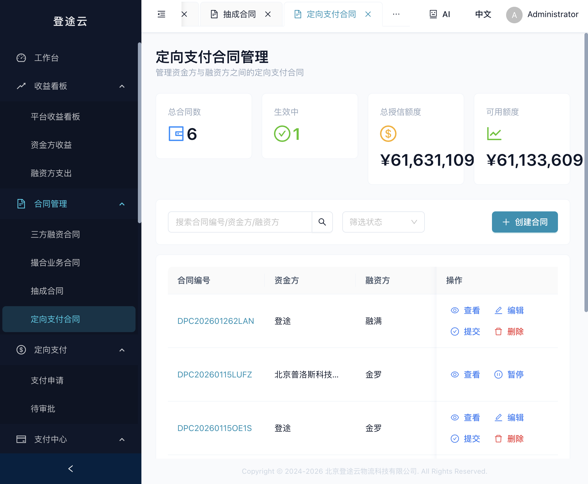
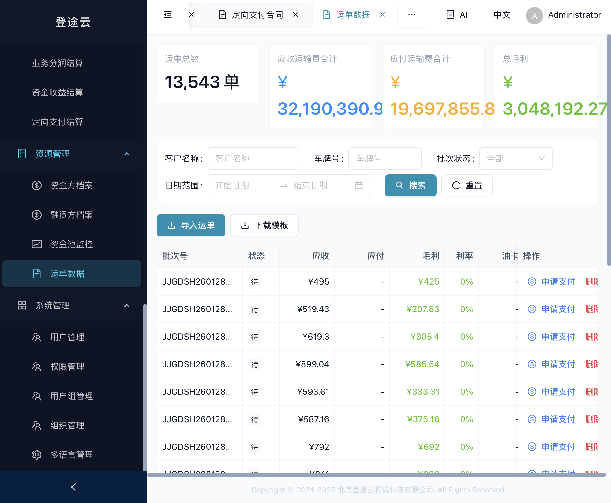
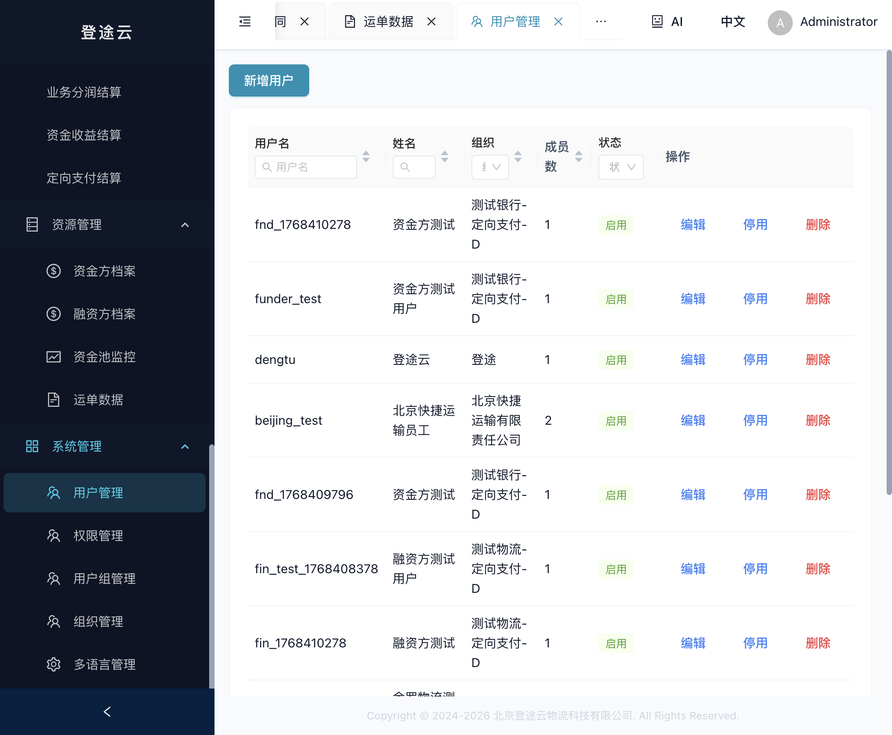
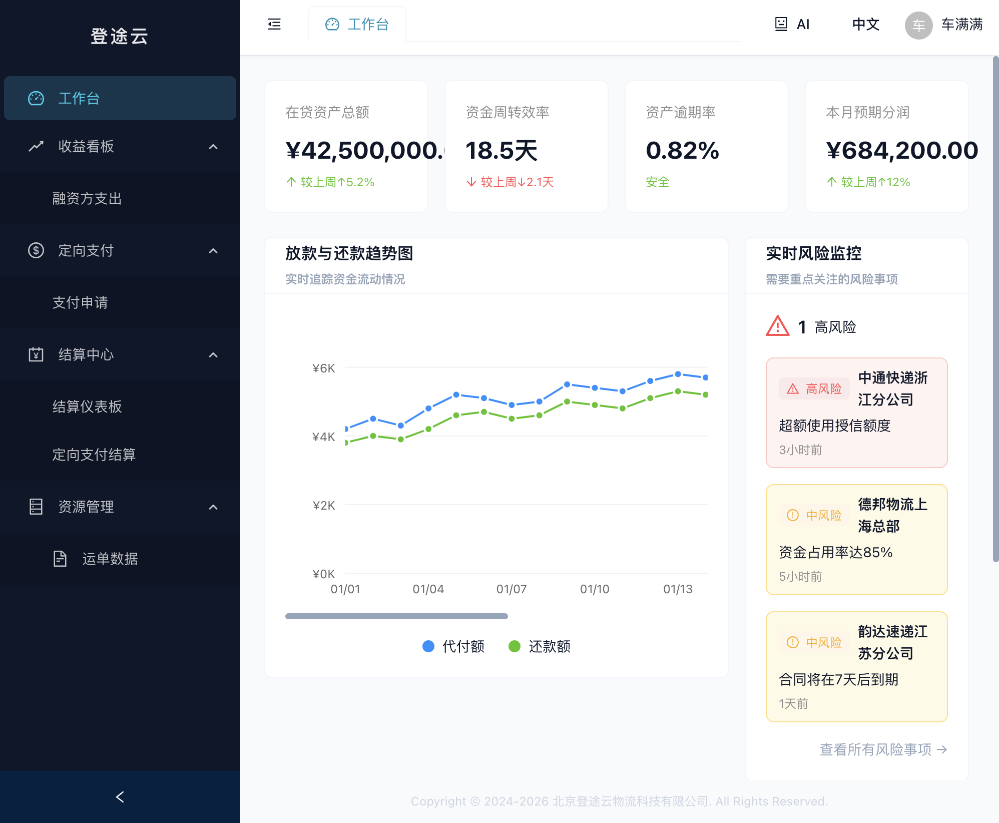
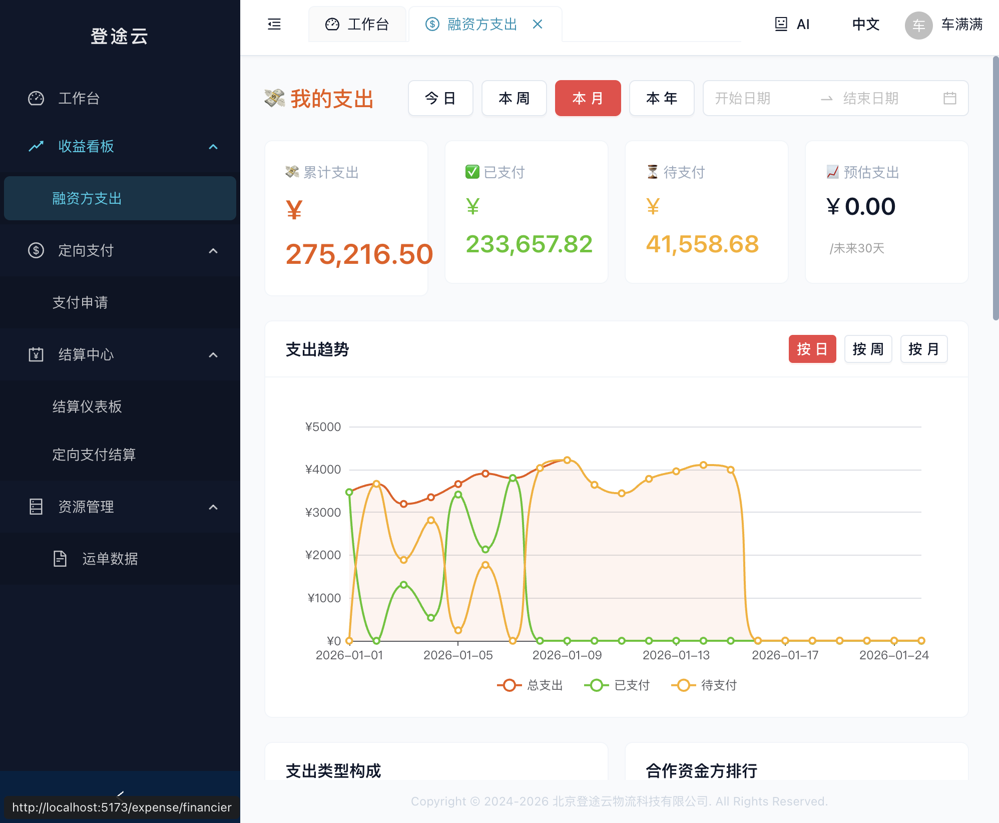
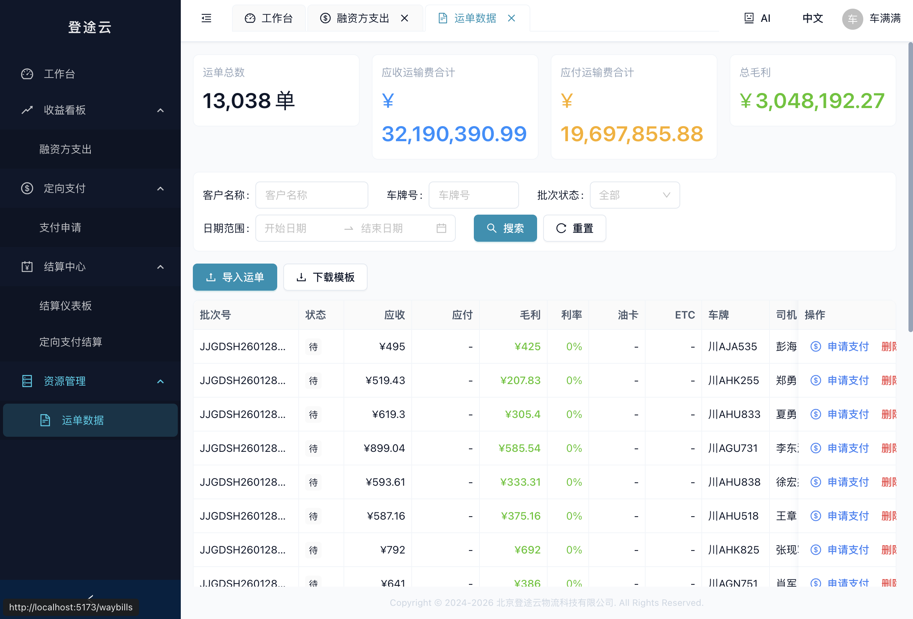
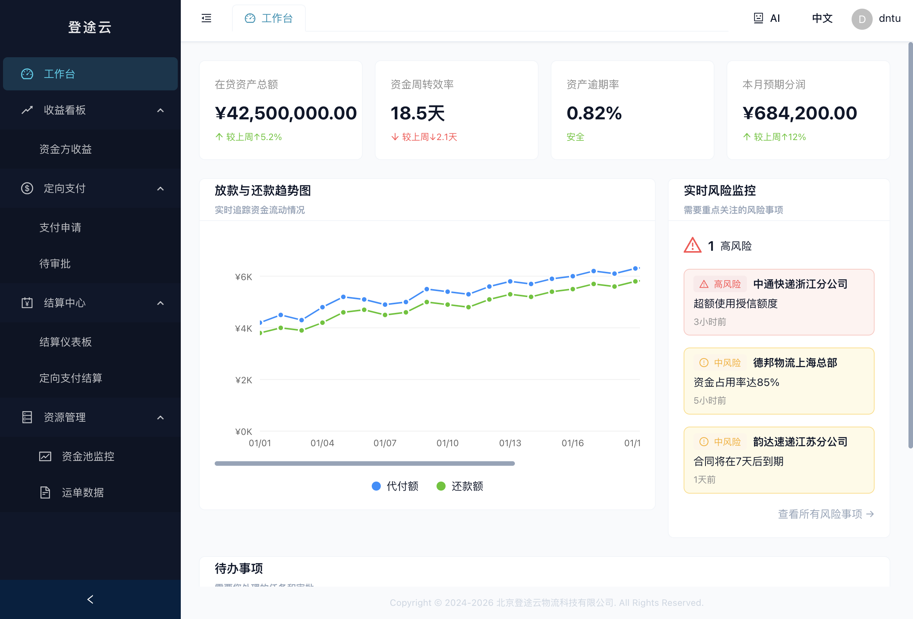
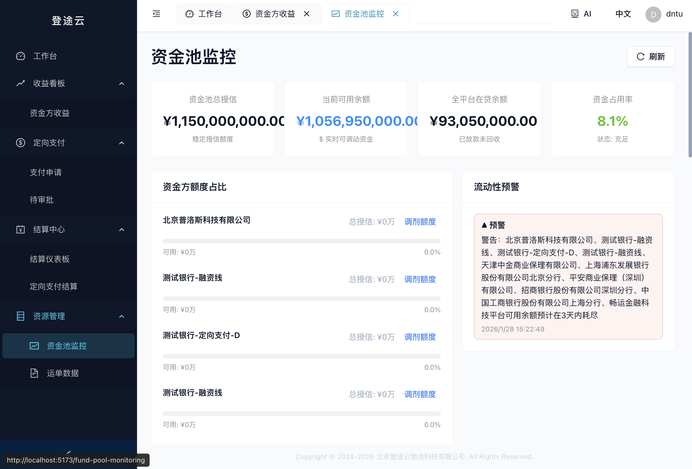

# 登途云物流金融服务平台 - 用户操作手册

> 版本：v1.0  
> 更新日期：2026年1月28日  
> 版权所有：北京登途云物流科技有限公司

---

## 目录

1. [系统概述](#1-系统概述)
2. [登录与权限](#2-登录与权限)
3. [工作台](#3-工作台)
4. [收益看板](#4-收益看板)
5. [合同管理](#5-合同管理)
6. [定向支付](#6-定向支付)
7. [支付中心](#7-支付中心)
8. [结算中心](#8-结算中心)
9. [资源管理](#9-资源管理)
10. [系统管理](#10-系统管理)
11. [融资方专属指南](#11-融资方专属指南)
12. [资金方专属指南](#12-资金方专属指南)
13. [常见问题](#13-常见问题)

---

## 1. 系统概述

### 1.1 平台简介

登途云物流金融服务平台是一个面向物流行业的综合金融服务系统，连接**平台运营方**、**资金方**（银行、保理公司等金融机构）和**融资方**（物流企业）三方，提供以下核心服务：

- **三方融资合同管理**：循环授信、放款、还款、利息计算
- **撮合业务合同管理**：业务撮合与分润结算
- **抽成合同管理**：按约定比例抽取服务费
- **定向支付管理**：资金定向支付给指定收款方

### 1.2 用户角色

系统支持三种用户角色，不同角色拥有不同的功能权限：

| 角色 | 说明 | 主要功能 |
|------|------|----------|
| **平台管理员** | 系统运营管理人员 | 全部功能，包括合同管理、结算管理、用户管理等 |
| **资金方用户** | 银行、保理公司等金融机构 | 收益查看、支付审批、定向支付结算等 |
| **融资方用户** | 物流企业 | 支出查看、支付申请、运单管理等 |

### 1.3 浏览器要求

- 推荐使用 **Chrome 90+**、**Firefox 88+**、**Edge 90+** 等现代浏览器
- 建议屏幕分辨率 **1920×1080** 或更高

---

## 2. 登录与权限

### 2.1 登录系统

打开浏览器，输入系统访问地址，进入登录页面。

**操作步骤：**
1. 在"用户名"输入框中输入您的账号
2. 在"密码"输入框中输入密码
3. 点击"登录"按钮

**注意事项：**
- 如果密码错误，系统会显示错误提示
- 连续多次输入错误密码可能导致账号临时锁定
- 首次登录后建议修改密码

### 2.2 修改密码

登录后，点击右上角用户头像，选择"修改密码"进行密码更改。

### 2.3 退出登录

点击右上角用户头像，选择"退出登录"即可安全退出系统。

---

## 3. 工作台

登录成功后，默认进入工作台页面。工作台是系统的首页，提供数据概览和快捷入口。

### 3.1 数据概览

工作台展示以下关键指标：
- **放款与还款趋势图**：展示近期放款和还款的趋势变化
- **实时风险监控**：显示当前系统的风险指标
- **待办事项**：提醒需要处理的任务

### 3.2 快捷导航

左侧菜单栏提供所有功能模块的快捷入口，点击即可进入相应功能。

---

## 4. 收益看板

收益看板用于查看和分析各方的收益/支出数据。

### 4.1 平台收益看板

**菜单位置**：收益看板 → 平台收益看板

**功能说明：**
- 查看平台整体收益数据
- 支持按日期范围筛选
- 可导出CSV格式报表
- 查看收益趋势图表

**操作指南：**
1. 使用顶部时间筛选器选择查看周期（今日/本周/本月/本年）
2. 也可以通过日期选择器自定义时间范围
3. 点击"导出CSV"可下载数据报表

### 4.2 资金方收益

**菜单位置**：收益看板 → 资金方收益

**功能说明：**
- 查看资金方的利息收入和服务费收入
- 查看收益趋势和构成分析
- 查看按融资方分组的收益排名

**数据指标：**
- **累计收益**：历史总收益金额
- **本期收益**：当前周期内的收益
- **预估收益**：未来30天的预估收益

### 4.3 融资方支出

**菜单位置**：收益看板 → 融资方支出

**功能说明：**
- 查看融资方的利息支出和服务费支出
- 分析支出趋势和构成
- 查看按合同分组的支出明细

---

## 5. 合同管理

合同管理是系统的核心功能模块，支持四种合同类型的全生命周期管理。

### 5.1 三方融资合同

**菜单位置**：合同管理 → 三方融资合同

**合同概念：**
三方融资合同是平台、资金方、融资方三方签订的融资协议，支持循环授信模式。

**主要字段：**
| 字段 | 说明 |
|------|------|
| 合同编号 | 系统自动生成的唯一标识 |
| 资金方 | 提供资金的金融机构 |
| 融资方 | 申请融资的物流企业 |
| 授信额度 | 最高可用融资金额 |
| 已用额度 | 当前已放款未还的金额 |
| 日利率 | 每日计息利率 |
| 状态 | 草稿/待审核/生效中/已结束 |

**操作功能：**
- **新建**：点击"新建三方融资合同"按钮创建新合同
- **查看**：点击"查看"按钮查看合同详情
- **编辑**：点击"编辑"按钮修改合同信息（仅草稿状态）
- **放款**：点击"放款"按钮进行放款操作
- **还款**：点击"还款"按钮记录还款
- **启用/停用**：控制合同是否生效
- **删除**：删除合同（仅草稿状态）

**创建合同步骤：**
1. 点击"新建三方融资合同"
2. **第一步**：填写基本信息（合同名称、资金方、融资方等）
3. **第二步**：设置额度与费率（授信额度、日利率、服务费率等）
4. **第三步**：配置利润分配规则（可选择是否分配、分配比例）
5. 点击"提交"完成创建

### 5.2 撮合业务合同

**菜单位置**：合同管理 → 撮合业务合同

**合同概念：**
撮合业务合同用于记录平台撮合资金方与融资方达成的业务协议。

**操作功能：**
- **录入合同**：记录新的撮合业务合同
- **查看详情**：查看合同具体内容
- **编辑**：修改合同信息
- **启用/停用**：控制合同状态
- **删除**：删除不需要的合同

### 5.3 抽成合同

**菜单位置**：合同管理 → 抽成合同

**合同概念：**
抽成合同约定平台从业务中按比例抽取服务费的规则。

**主要字段：**
- **合作方**：签订抽成协议的合作方
- **抽成比例**：服务费抽取比例
- **计算基准**：抽成的计算基础（如运费、毛利等）

### 5.4 定向支付合同

**菜单位置**：合同管理 → 定向支付合同

**合同概念：**
定向支付合同用于管理资金方向融资方提供的定向支付服务，资金只能支付给合同约定的收款方。

**统计指标：**
- **总合同数**：系统中的合同总数
- **生效中**：当前生效的合同数量
- **总授信额度**：所有合同的授信额度总和
- **可用额度**：当前剩余可用额度

**操作功能：**
- **创建合同**：新建定向支付合同
- **查看**：查看合同详情
- **编辑**：修改合同配置
- **提交**：提交合同进入审批流程
- **暂停**：暂停合同执行
- **删除**：删除合同

---

## 6. 定向支付

定向支付模块用于管理支付申请和审批流程。

### 6.1 支付申请

**菜单位置**：定向支付 → 支付申请

**功能说明：**
- 融资方发起支付申请
- 查看申请状态和历史记录
- 跟踪支付进度

**申请流程：**
1. 选择定向支付合同
2. 填写支付金额和收款信息
3. 选择支付类目
4. 提交申请等待审批

### 6.2 待审批

**菜单位置**：定向支付 → 待审批

**功能说明：**
- 资金方和平台审批支付申请
- 查看待审批的申请列表
- 执行通过或拒绝操作

**审批流程：**
1. 查看支付申请详情
2. 核实收款方和金额信息
3. 点击"通过"或"拒绝"完成审批
4. 审批通过后可执行支付

---

## 7. 支付中心

支付中心管理系统的支付流程和台账记录。

### 7.1 待办代付审核

**菜单位置**：支付中心 → 待办代付审核

**功能说明：**
- 审核代付请求
- 确认支付执行

### 7.2 支付流水台账

**菜单位置**：支付中心 → 支付流水台账

**功能说明：**
- 查看所有支付流水记录
- 支持按条件筛选
- 导出支付报表

### 7.3 单车运单台账

**菜单位置**：支付中心 → 单车运单台账

**功能说明：**
- 按车辆查看运单支付情况
- 跟踪运费结算状态

---

## 8. 结算中心

结算中心管理各类结算单的生成和处理。

### 8.1 结算仪表板

**菜单位置**：结算中心 → 结算仪表板

**功能说明：**
- 查看结算数据概览
- 监控结算进度
- 快速定位待处理结算

### 8.2 待处理结算单

**菜单位置**：结算中心 → 待处理结算单

**功能说明：**
- 查看需要处理的结算单
- 执行结算确认操作

### 8.3 融资还款结算

**菜单位置**：结算中心 → 融资还款结算

**功能说明：**
- 管理融资合同的还款结算
- 计算利息和本金

### 8.4 业务分润结算

**菜单位置**：结算中心 → 业务分润结算

**功能说明：**
- 管理撮合业务的分润结算
- 按合同约定比例计算分润

### 8.5 资金收益结算

**菜单位置**：结算中心 → 资金收益结算

**功能说明：**
- 管理资金方的收益结算
- 统计利息收入

### 8.6 定向支付结算

**菜单位置**：结算中心 → 定向支付结算

**功能说明：**
- 管理定向支付的结算
- 查看结算明细和状态

---

## 9. 资源管理

资源管理模块用于管理系统的基础数据和资源。

### 9.1 资金方档案

**菜单位置**：资源管理 → 资金方档案

**功能说明：**
- 管理资金方（金融机构）的基础信息
- 新增、编辑、查看资金方档案

**档案字段：**
- 机构名称
- 统一社会信用代码
- 联系人信息
- 银行账户信息

### 9.2 融资方档案

**菜单位置**：资源管理 → 融资方档案

**功能说明：**
- 管理融资方（物流企业）的基础信息
- 维护企业资质和联系方式

### 9.3 资金池监控

**菜单位置**：资源管理 → 资金池监控

**功能说明：**
- 监控各资金方的资金池状态
- 查看额度使用情况

### 9.4 运单数据

**菜单位置**：资源管理 → 运单数据

**功能说明：**
- 管理物流运单数据
- 支持批量导入运单
- 查看运单收支明细

**统计指标：**
- **运单总数**：系统中的运单总数
- **应收运输费合计**：应收金额总和
- **应付运输费合计**：应付金额总和
- **总毛利**：收支差额

**操作功能：**
- **导入运单**：批量导入运单数据
- **下载模板**：下载运单导入模板
- **搜索筛选**：按客户名称、车牌号、状态、日期筛选
- **申请支付**：发起运费支付申请
- **删除**：删除运单记录

---

## 10. 系统管理

系统管理模块用于配置和管理系统的各项设置。

### 10.1 用户管理

**菜单位置**：系统管理 → 用户管理

**功能说明：**
- 管理系统用户账号
- 分配用户权限和角色
- 控制用户状态（启用/停用）

**操作功能：**
- **新增用户**：创建新用户账号
- **编辑**：修改用户信息
- **启用/停用**：控制用户登录权限
- **删除**：删除用户账号

**用户字段：**
| 字段 | 说明 |
|------|------|
| 用户名 | 登录账号 |
| 姓名 | 用户真实姓名 |
| 组织 | 所属组织机构 |
| 成员数 | 关联的子成员数量 |
| 状态 | 启用/停用 |

### 10.2 权限管理

**菜单位置**：系统管理 → 权限管理

**功能说明：**
- 管理系统权限点
- 定义功能访问权限

### 10.3 用户组管理

**菜单位置**：系统管理 → 用户组管理

**功能说明：**
- 创建和管理用户组
- 批量分配权限给用户组

### 10.4 组织管理

**菜单位置**：系统管理 → 组织管理

**功能说明：**
- 管理组织架构
- 关联资金方和融资方

### 10.5 多语言管理

**菜单位置**：系统管理 → 多语言管理

**功能说明：**
- 管理系统多语言文本
- 支持中文和英文切换

### 10.6 参数配置

**菜单位置**：系统管理 → 参数配置

**功能说明：**
- 配置系统运行参数
- 设置默认值和业务规则

### 10.7 操作日志

**菜单位置**：系统管理 → 操作日志

**功能说明：**
- 查看系统操作日志
- 审计用户操作行为

---

## 11. 融资方专属指南

本章节专门针对融资方用户（物流企业），介绍融资方专属的功能和操作流程。

### 11.1 融资方界面概览

融资方用户登录后，可以看到针对融资方优化的界面和功能菜单。

**融资方可见功能：**
- 工作台（含资金数据概览、风险监控）
- 我的支出（收益看板 → 融资方支出）
- 支付申请（定向支付 → 支付申请）
- 结算中心（结算仪表板、定向支付结算）
- 运单数据

### 11.2 我的支出

**菜单位置**：收益看板 → 融资方支出

**功能说明：**
- 查看本企业的融资成本和利息支出
- 分析支出趋势和构成
- 支持按时间范围筛选（今日/本周/本月/本年）
- 支持导出Excel报表

**数据指标：**
- **累计支出**：历史总支出金额
- **已支付**：已完成支付的金额
- **待支付**：尚未支付的金额
- **预估支出**：未来30天的预估支出

### 11.3 发起支付申请

融资方用户可以发起定向支付申请，向供应商或司机支付运费等费用。

**操作步骤：**
1. 进入"支付申请"页面
2. 选择关联的定向支付合同
3. 填写支付金额、收款方信息
4. 选择支付类目
5. 提交申请等待资金方审批

### 11.4 运单管理

**菜单位置**：资源管理 → 运单数据

**功能说明：**
- 查看和管理本企业的运单数据
- 批量导入运单（Excel格式）
- 申请运费支付

**操作指南：**
1. 点击"导入运单"按钮上传运单文件
2. 系统自动解析运单数据
3. 确认无误后保存
4. 选择运单点击"申请支付"发起支付流程

---

## 12. 资金方专属指南

本章节专门针对资金方用户（银行、保理公司等金融机构），介绍资金方专属的功能和操作流程。

### 12.1 资金方界面概览

资金方用户登录后，可以看到针对资金方优化的界面和功能菜单。

**资金方可见功能：**
- 工作台（含资金数据概览、风险监控）
- 我的收益（收益看板 → 资金方收益）
- 定向支付（支付申请、待审批）
- 结算中心（结算仪表板、定向支付结算）
- 资金池监控
- 运单数据

### 12.2 资金池监控

**菜单位置**：资源管理 → 资金池监控

**功能说明：**
- 实时监控资金池状态
- 查看授信额度使用情况
- 监控各融资方的额度占比
- 接收流动性预警提醒

**数据指标：**
- **资金池总授信**：总授信额度
- **当前可用余额**：实时可调动资金
- **全平台在贷余额**：已放款未回收金额
- **资金占用率**：资金使用效率指标

### 12.3 支付审批

**菜单位置**：定向支付 → 待审批

**功能说明：**
- 审批融资方提交的支付申请
- 查看支付申请详情
- 执行通过或拒绝操作

**审批流程：**
1. 在"待审批"页面查看待处理申请
2. 点击申请查看详情（金额、收款方、用途）
3. 核实信息无误后点击"通过"
4. 如有问题可点击"拒绝"并填写原因

### 12.4 定向支付结算

**菜单位置**：结算中心 → 定向支付结算

**功能说明：**
- 查看定向支付结算单
- 确认结算金额
- 跟踪结算状态

---

## 13. 常见问题

### Q1: 忘记密码怎么办？
请联系系统管理员重置密码。

### Q2: 为什么看不到某些菜单？
菜单显示与您的用户权限相关，如需访问更多功能请联系管理员授权。

### Q3: 合同状态变更后如何修改？
- 草稿状态：可自由编辑和删除
- 待审核状态：需撤回后才能修改
- 生效中状态：部分字段不可修改
- 已结束状态：不可修改

### Q4: 如何导出数据？
大多数列表页面都提供"导出"功能，点击即可下载Excel或CSV格式文件。

### Q5: 系统访问速度慢怎么办？
- 检查网络连接
- 清除浏览器缓存
- 尝试使用推荐的浏览器

---

## 技术支持

如有问题，请联系：
- **技术支持邮箱**：support@dengtuyun.com
- **服务热线**：400-XXX-XXXX
- **工作时间**：周一至周五 9:00-18:00

---

*Copyright © 2024-2026 北京登途云物流科技有限公司. All Rights Reserved.*
